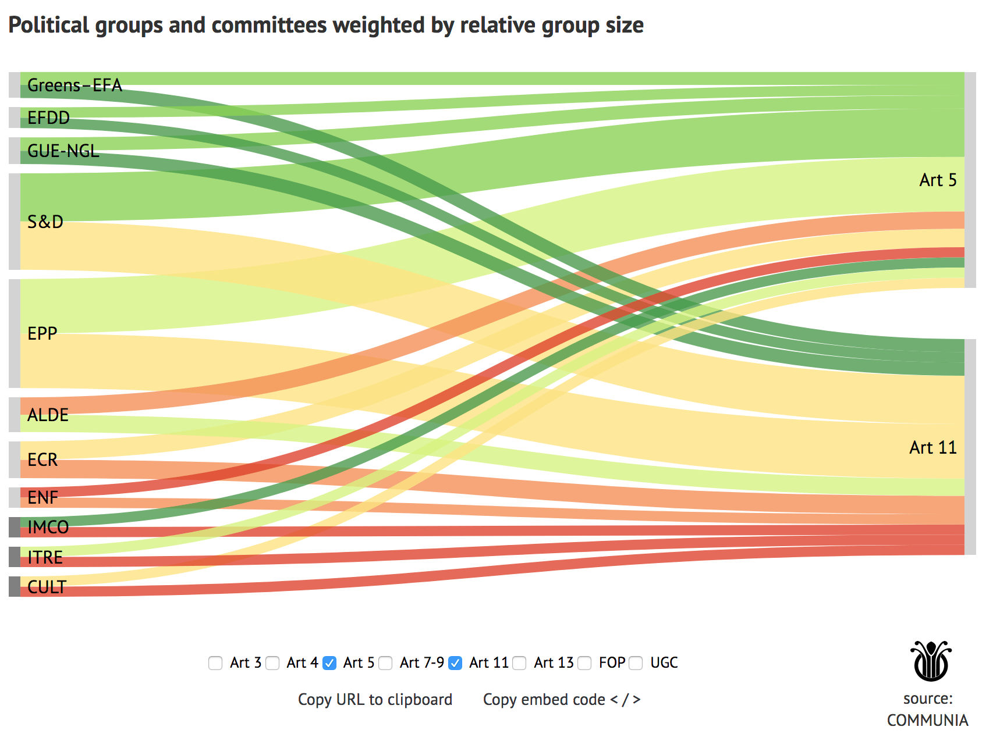

# Configurable Sankey for Communia / Kennisland

Sankey used in the article for COMMUNIA: <https://www.communia-association.org/juri-dsm-am-visualization/>
Large version of the sankey: <https://www.abitofdata.co/embed/communia/sankey-groups-interactive.html?Art=3&Art=4&Art=7-9>

[COMMUNIA](http://communia-project.eu) advocates for policies that expand the public domain and increase access to and reuse of culture and knowledge. We helped them with visualizing amendments made in the European Parliament that pertain to copyright. 

The political groups and committees are displayed on the left, and the articles they voted on on the right. The Sankey has a few features:

* Use the checkboxes to adjust the visualization
* Copy the configured URL or embed code for easy sharing of your particular configuration
* The sankey groups on the left side are sorted by total score, the groups on the right are sorted naturally
* The popup shows the score of each group and total score
* The bottom 3 elements on the left of the sankey are committees. They are manually sorted to the bottom, and have a different color.
